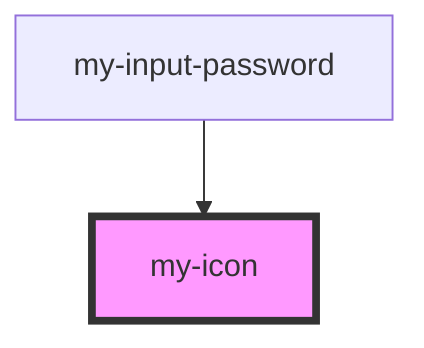

# my-icon

<!-- Auto Generated Below -->

## Properties

| Property            | Attribute     | Description                                                                            | Type                                                                                                                                                                                                                                                             | Default     |
| ------------------- | ------------- | -------------------------------------------------------------------------------------- | ---------------------------------------------------------------------------------------------------------------------------------------------------------------------------------------------------------------------------------------------------------------- | ----------- |
| `ariaHidden`        | `aria-hidden` | Set the icon to hidden, respectively `true`, to remove it from the accessibility tree. | `string`                                                                                                                                                                                                                                                         | `'true'`    |
| `ariaLabel`         | `aria-label`  | Specifies the label to use for accessibility. Defaults to the icon name.               | `string`                                                                                                                                                                                                                                                         | `undefined` |
| `icon` _(required)_ | `name`        | The name specifies which icon to use from the list                                     | `"ACCESSIBILITY" \| "ACCESSIBILITY-OUTLINE" \| "ALERT-CIRCLE-OUTLINE" \| "ARROW-FORWARD-OUTLINE" \| "ELLIPSIS-HORIZONTAL" \| "ELLIPSIS-HORIZONTAL-OUTLINE" \| "ELLIPSIS-VERTICAL" \| "ELLIPSIS-VERTICAL-OUTLINE" \| "EYE" \| "EYE-OFF-OUTLINE" \| "EYE-OUTLINE"` | `undefined` |
| `size`              | `size`        | Specifies the default size `SMALL \| MEDIUM \| LARGE` of the icon. MEDIUM is default   | `"LARGE" \| "MEDIUM" \| "SMALL"`                                                                                                                                                                                                                                 | `'SMALL'`   |

## Dependencies

### Used by

 - [my-input-password](../my-input-password)

### Graph

----------------------------------------------

*Built with [StencilJS](https://stenciljs.com/)*
