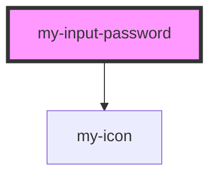

# my-input-password

<!-- Auto Generated Below -->

## Properties

| Property            | Attribute     | Description | Type      | Default     |
| ------------------- | ------------- | ----------- | --------- | ----------- |
| `isPasswordVisible` | `visible`     |             | `boolean` | `false`     |
| `placeholder`       | `placeholder` |             | `string`  | `undefined` |

## Events

| Event          | Description | Type                   |
| -------------- | ----------- | ---------------------- |
| `showPassword` |             | `CustomEvent<boolean>` |

## Methods

### `getValue() => Promise<boolean>`

#### Returns

Type: `Promise<boolean>`

## Dependencies

### Depends on

- [my-icon](../my-icon)

### Graph

----------------------------------------------

*Built with [StencilJS](https://stenciljs.com/)*
